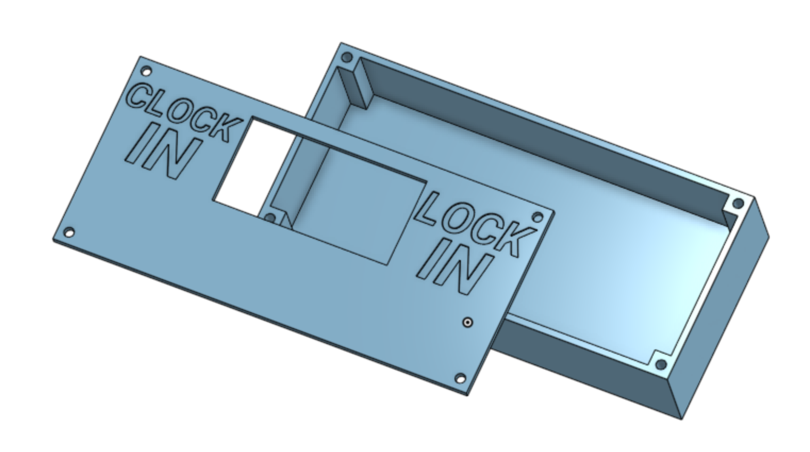
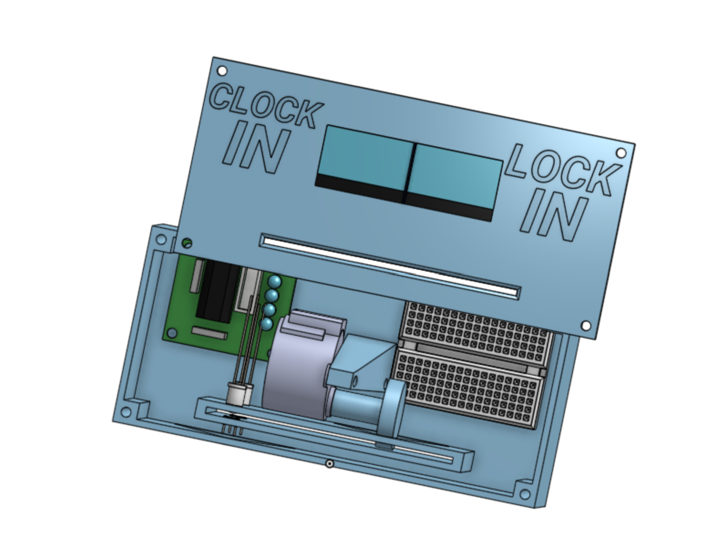
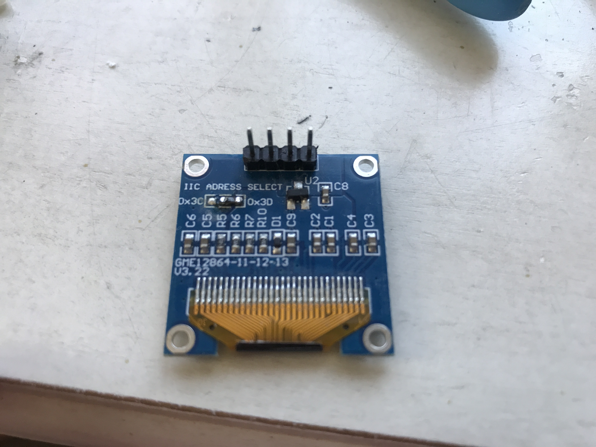

# Lock'n Clock'n

Hi! Welcome to my journal for my Lock'n Clock'n project!

# Devlog 1
1h 5m 4s Logged

I started the Lock'n Clock'n today! I cadded the case, the face, and the punch card. I think I'll just use index cards for those. I still don't know how I'll punch the cards, but I'm sure that I'll figure it out. In the meantime, I also added some 3D models of the parts I'll be using, and I CADed screw holes and text. I'm excited to keep going!

# Devlog 2
1h 21min Logged

I CADed the system that will detect the position of the punch card in the Clock'n Lock'n. There will be an LED and a photoresistor, and the LED will constantly shine on the photoresistor. However, when the punch card is pushed through, the photoresistor will sense the light level drop. When a hole on the side of the punch card comes up, the light level will return to normal, and the Clock'n Lock'n will know the position of the punch card. I also started CADing the movement system. I plan to use a 28BYJ-48 Stepper Motor for percise control. I will need a second LED-photoresistor system to trigger it, or I will need to move the initial one up. We'll see which is more convenient for spacing. Yes, space management has been a real issue in this project. I wanted it to take up little space, so you could easily put it on your desk, but it seems I will have to make some comprimises. 

# Devlog 3
1h Logged

I CADed the Stepper mount and the wheel that will push the paper through the slot. Not a lot to say, just took a long time. 

# Devlog 4
1h 41min 28sec Logged

I coded and built the first prototype of the Clock'n Lock'n! I just had one position detection module and the movement module for now. The code was pretty simple, just a continuously spinning motor and a reading photoresistor. I think that I need a two-point axle for the movement module, as it was too flimsy and wouldn't hold in place. The position detection system worked well, as it gave a 32-unit difference between the punches. I need to make the case larger to fit an internal puncher and the movement module's second axle point. In the meantime, the test worked well!

# Devlog 5
1h 20min Logged

I got rid of the 28BYJ-48 Stepper motor and replaced it with a modified SG90 servo motor. I modified it by disconnecting the encoder and getting rid of the mechanical plastic catch, making it bacically a mini high-torque dc motor. I can control the speed, but I can't control the position anymore (due to the disconnected encoder). That's alright, as I can tell the position of the punch card anyway through the LED-photoresistor modules. Getting rid of the 28BYJ-48 in favor of the SG90 also has the benefit of saving space in the case, not only with the motor itself but also in the lack of a driver module. 

# Devlog 6
1h 10m 50sec Logged

I coded the test code and part of the actual code. I had to spend time coding the logic on the positioning, and I also had to do some soldering on the back of one of my OLEDs to change its adress. Again, not a lot to say, just a lot of difficult work, troubleshooting, but getting there in the end (:

